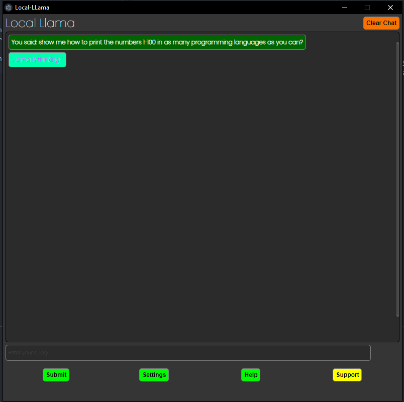
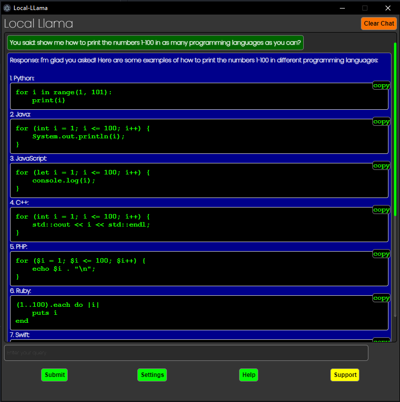

# Electron-llama

## Description

This is an Electron app that uses provides a simple gui for running and and querying llama-cpp-python, It is based on the code i created for the same task but in a chrome extension.
this is a work in progress and is inteneded to allow me to learn more about electron and nodejs.

## Releases

* Coming soon!

## Installation

```bash
git clone
cd electron-llama
npm install
```

## Usage

```bash
npm start
```

# Images



